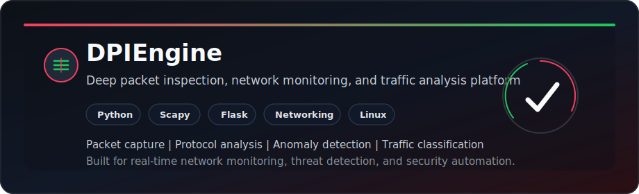

<div align="center">


# Hi, I'm Ayush Priyadarshan

**Cybersecurity engineer focused on offensive security, AI/ML-driven threat detection, network security, and practical automation.**


<br>

<a href="https://www.github.com/ayush001844"></a>
<a href="https://www.linkedin.com/in/ayushpriyadarshan"></a>

<br>
<br>


<a href="https://github.com/ayush001844?tab=followers"></a>


</div>

---

## About Me

```yaml
handle: ayush001844
role: Cybersecurity Engineer | AI/ML Researcher | Offensive Security
focus: Network security, DPI, AI-driven threat detection, vulnerability assessment
languages: Python, C, SQL, Bash, JavaScript
platforms: Linux, Kali, Windows, Docker, GitHub Actions
mindset: "Securing systems through intelligence, automation, and offensive validation."
```

- I build security tools that integrate AI/ML for threat detection and anomaly classification.
- I practice network security, deep packet inspection, and secure cryptographic image processing.
- I develop scalable backend services and robust secure communication frameworks.
- I care about responsible disclosure, authorized testing, and practical remediation.

## Current Focus

| Track | What I am improving |
| --- | --- |
| AI in security | RAG, Agentic AI, LangChain, deep learning models for threat detection and anomaly classification |
| Network security | Deep packet inspection engines, protocol analysis, traffic classification, and secure messaging |
| Offensive security | Penetration testing, vulnerability assessment, DDoS mitigation, and web app security |
| Documentation | Clear writeups with steps to reproduce, impact, evidence, and remediation |

## Featured Build

<div align="center">

<a href="https://github.com/ayush001844/DPI-_ENGINE">
  
</a>

</div>

**DPIEngine** is my deep packet inspection and network security platform for real-time traffic monitoring, protocol analysis, anomaly detection, and threat classification.

- Python backend with modular packet processing pipeline
- Scapy-based packet capture, protocol dissection, and traffic analysis
- Anomaly detection, traffic classification, and low-latency processing
- Report-focused output for both technical review and security audit documentation

---

## Tech Stack

<div align="center">

           

</div>

---

## GitHub Stats

<div align="center">


</div>

---

## Education & Experience

🎓 **B.Tech in Computer Science & Engineering (Cyber Security)**
*Rashtriya Raksha University, Gujarat* (Aug 2023 – 2027) • CGPA: 7.88/10

💼 **Internships:**
- **NIT Raipur** – Project Internship (Cryptography & Secure Image Processing)
- **Debadarsan Consulting** – Project Internship (Website Security, DDoS Mitigation, Nessus)

📜 **Certifications:**
- CompTIA PenTest+ ce
- NPTEL Cloud Computing (Top 1%)
- CISCO Ethical Hacking, Modern AI, Introduction to Data Science
- IIIT Allahabad Ethical Hacking & Penetration Testing

---

<div align="center">


</div>
